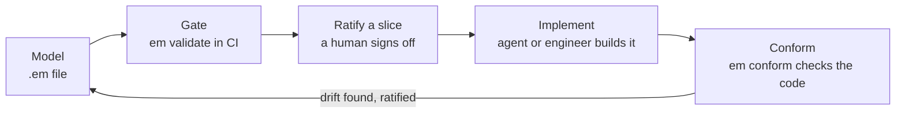

# em — event modeling in plain text

`em` is a command-line tool for [Event Modeling](https://eventmodeling.org/). You write a
model in a small, slice-first DSL and `em` renders it as a clean, deterministic diagram.
Because the source is plain text — diff-able, reviewable, unambiguous — it's as easy for an
AI to write and edit as it is for a person, and `em validate` keeps either one honest.


The source for that diagram is [about 70 lines of text](examples/order-fulfillment.em) — or
see it as a [full project](examples/order-fulfillment/), slice docs and all, for a guided
tour of the rest of the toolchain.

## Install

```bash
npm install -g @milehimikey/em
```

Requires Node ≥ 18. SVG, PNG, and PDF rendering are all fully self-contained (Graphviz runs
as bundled WebAssembly); nothing else to install. Only rarer formats (ps, eps, ...) need an
optional system dependency — see [docs/dependencies.md](docs/dependencies.md).

## Quickstart

```bash
em init model.em          # scaffold a starter model
em render model.em        # -> model.svg  (open it in a browser)
em watch model.em --serve # live browser view, re-renders on every save
em validate model.em      # check event-modeling rules
```

Once a model is real and committed, `em` keeps working on it over time:

```bash
em export model.em        # versioned JSON, for agents and tooling
em diff model.em --from HEAD~1   # what this change did to the model
em changelog model.em     # the model's git history as a business ledger
```

A model is a list of slices — vertical time steps, read left to right — whose elements land
in swimlane rows:

```em
model "Order Fulfillment"

persona Customer
context Order

slice "Browse Catalog" {
  ui Product Catalog @Customer
  command Place Order
  event Order Placed @Order
}

slice "View Open Orders" {
  view Open Orders from "Order Placed"
  ui Order List @Customer
}
```

The [tutorial](docs/tutorial.md) builds a complete model from an empty file in about twenty
minutes, and [docs/workflow.md](docs/workflow.md) picks up where it leaves off: how a model
gets specified, gated in CI, handed to implementation, and checked against the code that
implements it.

## How it works

Model, gate, ratify, implement, check — repeat as the system evolves. Humans make the calls
that matter (build the model, ratify a slice, rule on drift); `em` and its agents handle the
mechanical parts in between. This is the loop in miniature — see
[docs/workflow.md](docs/workflow.md) for the full seven-stage lifecycle and
[docs/process.md](docs/process.md) for exactly who (or what) does each part.



## Model with AI

`em` ships a Claude Code skill that runs a facilitated Event Modeling session: the AI asks
the questions, you supply the domain, and the model renders live as it grows.

```bash
em skill install          # copy the skill into .claude/skills/event-modeling/
```

Then run `/event-modeling` in Claude Code. The same skill also runs the reverse direction:
`extract` derives a model from a system that already exists, and `conform` checks a model
against the code implementing it and reports where they've drifted. See
[docs/ai-workflow.md](docs/ai-workflow.md) for the phases and what a session produces, and the
[em-with-ai repository](https://github.com/milehimikey/em-with-ai) for a ~50-slice model
built this way.

## Documentation

| Doc | What it answers |
|---|---|
| [docs/tutorial.md](docs/tutorial.md) | Learn the tool by building a model from scratch |
| [docs/workflow.md](docs/workflow.md) | The model lifecycle: specify, gate, hand off, track change, detect drift |
| [docs/process.md](docs/process.md) | Who does what: where humans are required, where agents work with review |
| [docs/patterns.md](docs/patterns.md) | The four Event Modeling patterns and their DSL shapes |
| [docs/dsl.md](docs/dsl.md) | Full DSL reference: keywords, `from`, `again`, fields, notes |
| [docs/cli.md](docs/cli.md) | Every command and flag |
| [docs/validation.md](docs/validation.md) | Every rule `em validate` checks, and the fixes |
| [docs/ci.md](docs/ci.md) | Copy-paste CI recipes: validate `.em` changes, run conformance on a schedule |
| [docs/timeline.md](docs/timeline.md) | The Two Laws of the Timeline |
| [docs/ai-workflow.md](docs/ai-workflow.md) | The Claude Code skill: install, phases, artifacts |
| [docs/dependencies.md](docs/dependencies.md) | What's bundled vs. what needs a system install |
| [docs/usage-data.md](docs/usage-data.md) | What usage data em captures, and how to roll it up for a retro |
| [docs/architecture.md](docs/architecture.md) | How rendering works; why Graphviz, not PlantUML |
| [docs/roadmap.md](docs/roadmap.md) | What's planned |
| [docs/decisions/](docs/decisions/) | Write-ups for open design questions (starts with [MIL-162](docs/decisions/mil-162-teachable-navigator.md), the stakeholder-portal decision) |

## Development

```bash
npm install
npm run build          # produces dist/, exposes the `em` bin
npm test               # vitest
npx tsx src/cli.ts <command> ...   # run straight from source
```

## License

[MIT](LICENSE) © milehimikey
