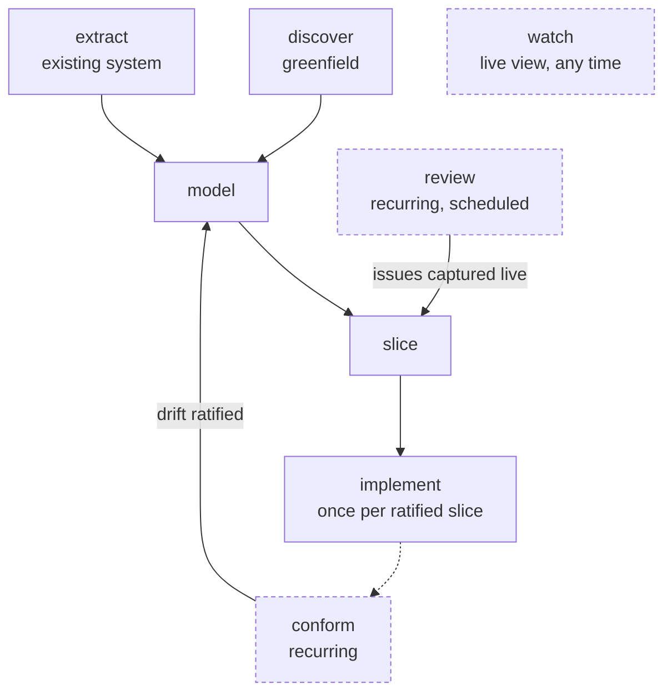

# Modeling with AI

Two commands get you a guided session:

```bash
em skill install     # copies the skill bundle into .claude/skills/
```

then, in Claude Code:

```
/event-modeling
```

## What the skill is

`em` ships a Claude Code skill *bundle* inside the npm package — six directories under
`.claude/skills/`, one router (`event-modeling`, the `/event-modeling` entry point) plus five
focused, SDLC-stage skills (`event-modeling-discover`, `-design`, `-implement`, `-conform`,
`-review`), and a shared, non-skill directory (`event-modeling-shared`) holding the DSL/
methodology reference and templates every skill points back to instead of duplicating (MIL-157;
before that, all nine phases lived behind one skill and one broad trigger description). It turns
a modeling session into a facilitated conversation: the AI asks focused questions one at a time —
who acts, what fact gets recorded, what must always be true — and builds the `.em` model from
your answers. It never invents domain facts; anything unresolved is parked as an open question
instead of guessed. Behind the scenes it drives the `em` CLI, re-rendering after each increment
and running `em validate` to keep the diagram honest.

`em skill install` copies the whole bundle into your project in one step (`--force` to overwrite
an existing copy), so it's versioned with your repo and works for anyone who opens it in Claude
Code. You never invoke the five phase skills by installing them separately — one `em skill
install`/`em skill sync` keeps all six directories in sync together, the same one-command
experience as before the split.

**Which skill fires for a given request:** `/event-modeling` (with or without a phase name) always
routes through the `event-modeling` skill, which reads `.event-modeling.md`'s recorded phase (or
the phase name you gave it) and hands off to the matching focused skill — see that skill's own
`SKILL.md` for the full phase → skill table. For a request that already names its intent plainly
("extract a model from this codebase", "write the slice doc for Checkout", "check this model for
drift"), Claude Code can trigger the matching `event-modeling-*` skill directly, without going
through the router at all — that's the payoff of narrower per-skill `description:` triggers over
one skill covering all nine phases.

**Upgrading from before the split (pre-1.9.0):** re-run `em skill install --force` (or
`em skill sync`) — it replaces the old, single `.claude/skills/event-modeling/` (which held every
phase plus all reference docs and templates) with the six new directories. Nothing in your model
files, slice docs, or `.event-modeling.md` state changes; only the skill's own vendored layout
does. `em skill check` flags the old layout as drifted if you skip this step.

## Implementing outside Claude Code

The facilitation phases (`discover`/`extract` → `model` → `slice`) are Claude Code sessions,
but the `implement` phase's
[agent guide](../.claude/skills/event-modeling-implement/reference/implement.md)
is written to apply to *any* implementing agent. `em contract` prints that guide to stdout —
no `.claude/` awareness or vendored skill copy required — and `em skill install`/`em skill
sync` write a matching pointer into the repo's `AGENTS.md` by default, alongside the
readiness gate (`em validate --slice-ready --json`) and the machine-readable read path
(`em export --slice`). See [cli.md](cli.md#em-contract) and
[cli.md](cli.md#working-with-an-ai-agent-the-agentsmd-managed-section).

An agent that speaks MCP natively can skip the shell entirely: `em-mcp` (or `em mcp`) starts a
stdio MCP server exposing the same contract, readiness gate, and read path — plus full
`validate`/`export`/marker-listing access — as tools instead of CLI flags. See
[mcp.md](mcp.md).

## Phases

`/event-modeling` takes an optional phase argument. With no argument it resumes wherever
the previous session left off.



`discover`/`extract`, `slice`, and `implement` are the once-per-model (or once-per-slice)
spine; `conform`, `review`, and `watch` (dashed above) are recurring or ongoing rather than
steps in that sequence — see each phase's own row below. `validate` isn't pinned to one point
either: it's woven through every phase's end-of-phase checks as well as being runnable on its
own.

Most phases run once per model, in roughly the order below — but `implement` runs **once per
ratified slice**, and `conform` is a **recurring** one, run again whenever the codebase has
moved. [workflow.md](workflow.md) puts these phases
in the context of a model's whole life, alongside the CLI commands (`em diff`, `em changelog`)
that live between sessions.

| Phase | Skill | What it does | What it leaves behind |
|---|---|---|---|
| `discover` | `event-modeling-discover` | Steps 1–4 for a greenfield process: brainstorm past-tense events, storyboard them, find the commands and read models | A draft `.em` with the happy-path spine |
| `extract` | `event-modeling-discover` | The as-is sibling of discover: derives a current-state model from an existing system (event-driven or procedural), confirming each round with you | A validated as-is `.em`, unknowns parked as `# TBD` |
| `model` | `event-modeling-design` | Steps 5–7: group events into contexts, classify every slice as one of the [four patterns](patterns.md), check completeness | A structurally complete, validated model |
| `slice` | `event-modeling-design` | Deep-dive one slice at a time: fields, invariants, Given/When/Then scenarios, error flows | One implementation-ready `slices/<name>.md` per slice, wired in via `note` |
| `implement` | `event-modeling-implement` | Builds one **ratified** slice into code, following the bundled [agent guide](../.claude/skills/event-modeling-implement/reference/implement.md): readiness-gated (`em validate --slice-ready`), slice doc treated as the read-only spec, gaps surfaced to you rather than decided silently | A merged PR; the slice doc flipped to `implemented` with its `implementedIn` link |
| `conform` | `event-modeling-conform` | Checks a ratified model (and its slice docs) against the codebase that implements it: evidence-first per-slice walk, `em diff --json` for structural drift, findings classified with cited evidence | An advisory `conformance/<date>-report.md` with proposed red notes you ratify |
| `watch` | `event-modeling-review` | Starts `em watch --serve` in the background for a live team view | A running live viewer |
| `review` | `event-modeling-review` | Facilitated stakeholder walkthrough: steps the live viewer's Review mode through slices one at a time, capturing anything the room raises as `issue "..."` red notes | Triaged issues; a `Last stakeholder review:` marker in the state file |
| `validate` | `event-modeling-conform` | Walks every diagnostic with you and applies fixes, plus the one check the validator can't do itself | A clean `em validate` |

Each phase skill's own preconditions locate the model and, when invoked with no argument, defer
to the `event-modeling` router skill — so `/event-modeling` alone is still all you need to
remember, exactly as before the split.

## What a session produces

```
<model-name>/
  <model-name>.em               # the model
  <model-name>.svg              # kept fresh by em watch
  README.md                     # overview + slice index
  .event-modeling.md            # session state — this is what makes sessions resumable
  slices/<slice-name>.md        # one implementation spec per slice
  conformance/<date>-report.md  # conform-phase drift reports (advisory)
```

The `.event-modeling.md` state file records the current phase, decisions made, open questions,
and a Usage log (phases touched, validate diagnostic categories hit — see
[usage-data.md](usage-data.md)), so you can stop mid-session and pick up in a fresh conversation
days later.

More than one model in the same project? Give each one its own directory (this same layout,
repeated), nested under a shared `models/` parent — see
[cli.md, "Multi-model projects"](cli.md#multi-model-projects) and
[examples/multi-model/](../examples/multi-model/).

## A complete worked example

The [em-with-ai repository](https://github.com/milehimikey/em-with-ai) is a full AI-built
model of a headless CPQ system — around 50 slices with slice specs — and shows what the
skill produces at real-world scale.
