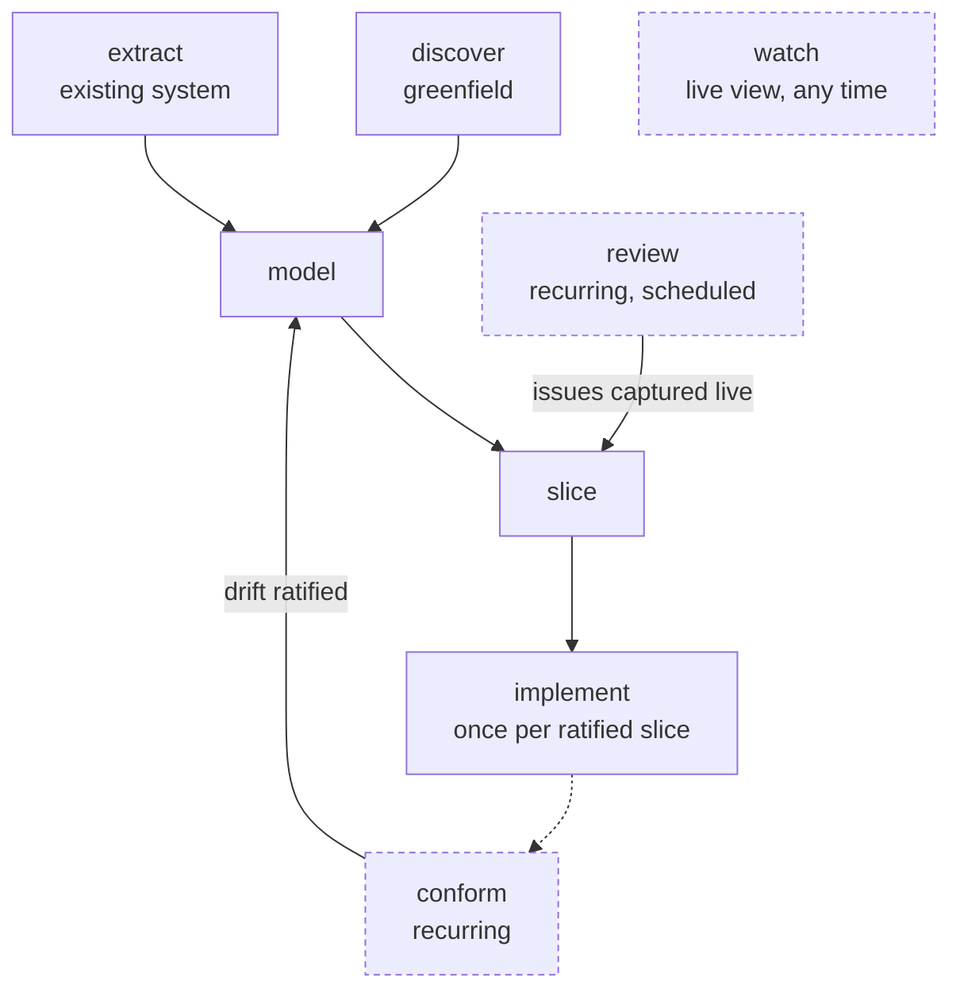

# Modeling with AI

## The plugin route

`em` ships its skill bundle as a Claude Code plugin named `em`, pinned to the em release you run.
Two commands, once per machine (the examples use 1.14.0; use your own `em --version`):

```bash
claude plugin marketplace add milehimikey/em@v1.14.0 --scope project
claude plugin install em@em-1-14-0 --scope project
```

Both are required, in this order: `claude plugin install` alone fails with "Plugin not found in
marketplace" even when the repo already carries the settings entries, because the marketplace has
to be registered on the machine first. The first command also writes the settings entry below; the
second writes `enabledPlugins`. Commit both so collaborators and CI see the same pin:

```json
{
  "extraKnownMarketplaces": {
    "em-1-14-0": {
      "source": { "source": "github", "repo": "milehimikey/em", "ref": "v1.14.0" }
    }
  },
  "enabledPlugins": { "em@em-1-14-0": true }
}
```

The marketplace name carries the exact em version (`em-` plus the version with dots as dashes).
That is deliberate: marketplace registration is per user and keyed by name, so two repos pinning
different tags under one name would silently run the first one's content. Each tag's
`.claude-plugin/marketplace.json` declares its own versioned name, and `plugin.json`'s `version`
is the release version, so a re-pushed tag never moves an installed copy. Old per-version
registrations accumulate under `~/.claude/plugins/`; remove one with `claude plugin marketplace
remove em-1-13-1`. The plugin also bundles the em MCP server (`npx -y @milehimikey/em@<version>
mcp`, see [mcp.md](mcp.md)); it needs Node 18+.

Then, in Claude Code:

```
/em:event-modeling
```

The skills are namespaced by the plugin: `/em:event-modeling` (the router), `/em:discover`,
`/em:design`, `/em:implement`, `/em:conform`, `/em:review`. The plugin tree under `plugin/` in the
em repo is generated from `.claude/skills/` by `scripts/build-plugin.ts` (`npm run docs:generate`);
CI fails on drift. Its shared references resolve through `${CLAUDE_PLUGIN_ROOT}`.

### What `em skill check` verifies for a plugin repo

`em skill check` (and the `skill-check` job in the [CI preset](ci.md)) recognises a repo that
pins the plugin and checks it two ways (MIL-231): the committed settings must pin the marketplace
and `ref` of the em release you run, with `em@<name>` enabled (`plugin-pin-mismatch`,
`plugin-not-enabled`), **and** this machine must have that same marketplace registered at that
ref (`plugin-registered-at-different-ref`, `plugin-not-installed-locally`). The second half exists
because registration is per user: settings alone cannot prove which content the agent runs. A
missing local registration prints the two install commands above and exits 0 on a dev machine; it
exits 1 under `--ci` / `CI=true`. The registry location follows `EM_CLAUDE_PLUGINS_DIR` (default
`~/.claude/plugins`). Full finding table: [cli.md](cli.md#em-skill-check-path).

### Sub-agents em ships

The engagement phase, and who operates these agents, is described in [process.md](process.md#engagements-who-operates-the-agents); the constitution's `Agent models`, `Merge strategy` and `Test command` lines configure them.

em ships four Claude Code sub-agent definitions (MIL-269) that the engagement skill dispatches; each
states an explicit `tools:` allowlist and fixes no model (the dispatcher passes it):

| Agent | May do | Output |
| --- | --- | --- |
| `em-implementer` | Read, write and edit code and tests for exactly one slice in the worktree and branch it is given; loads the implement skill and the constitution's routing table. Never edits the slice doc, the `.em`, another slice or shared infra; never merges or rebases; stops on a gap | PR URL and a per-invariant test map |
| `em-validator` | Read-only plus `Bash` to run `--slice-ready`, `em coverage --slice --strict`, the constitution's `- **Test command:**` line, and the footprint and no-diff checks | pass or fail per check |
| `em-reviewer` | Read-only: spec fidelity, slice isolation, constitution conformance; every finding cites a doc line or constitution rule | findings list, `- [<severity>] <file:line or doc §> — <finding>` |
| `em-critic` | Same as the reviewer, in fresh context on a different model, never shown the reviewer's findings | same findings list |

The validator, reviewer and critic carry no `Write`, `Edit` or `NotebookEdit`. `Bash` cannot be
partially allowed in an agent definition, so their read-only behavior beyond that rests on their
instructions. Under the plugin they are `em:em-implementer`, `em:em-validator`, `em:em-reviewer` and
`em:em-critic` (built into `plugin/agents/`); in a vendored repo they live in `.claude/agents/`,
reconciled by `em skill install|sync|check` and `em upgrade` without touching your own agents there.

## Vendored skills (deprecated in 1.14, removed in a later major)

The original route copies the bundle into the repo instead:

```bash
em skill install     # copies the skill bundle into .claude/skills/
```

then run `/event-modeling` (the vendored names are `event-modeling`, `event-modeling-discover`,
`-design`, `-implement`, `-conform`, `-review`). `em skill sync` and `em skill check` keep working in
1.14; `em skill install`/`sync` print a deprecation notice naming the plugin, and `em upgrade --apply`
migrates a vendored repo in one commit (its `skill-plugin` step removes the eight vendored
directories, pins the plugin in `.claude/settings.json`, and refreshes the `AGENTS.md` section);
run the two install commands once per machine afterwards. The rest of this page describes the skills by their
vendored names; under the plugin each `event-modeling-<phase>` is `em:<phase>` and `/event-modeling`
is `/em:event-modeling`.

## What the skill is

`em` ships a Claude Code skill *bundle* inside the npm package — eight directories under
`.claude/skills/`, one router (`event-modeling`, the `/event-modeling` entry point) plus six
focused, SDLC-stage skills (`event-modeling-discover`, `-design`, `-implement`, `-conform`,
`-review`, `-engagement`), and a shared, non-skill directory (`event-modeling-shared`) holding the DSL/
methodology reference and templates every skill points back to instead of duplicating (MIL-157;
before that, all nine phases lived behind one skill and one broad trigger description). It turns
a modeling session into a facilitated conversation: the AI asks focused questions one at a time —
who acts, what fact gets recorded, what must always be true — and builds the `.em` model from
your answers. It never invents domain facts; anything unresolved is parked as an open question
instead of guessed. Behind the scenes it drives the `em` CLI, re-rendering after each increment
and running `em validate` to keep the diagram honest.

On the vendored route, `em skill install` copies the whole bundle into your project in one step (`--force` to overwrite
an existing copy), so it's versioned with your repo and works for anyone who opens it in Claude
Code. You never invoke the six phase skills by installing them separately — one `em skill
install`/`em skill sync` keeps all eight directories in sync together, the same one-command
experience as before the split.

**Which skill fires for a given request:** `/event-modeling` (with or without a phase name) always
routes through the `event-modeling` skill, which reads `.event-modeling.md`'s recorded phase (or
the phase name you gave it) and hands off to the matching focused skill — see that skill's own
`SKILL.md` for the full phase → skill table. For a request that already names its intent plainly
("extract a model from this codebase", "write the slice doc for Checkout", "check this model for
drift"), Claude Code can trigger the matching `event-modeling-*` skill directly, without going
through the router at all — that's the payoff of narrower per-skill `description:` triggers over
one skill covering all nine phases.

> **What a design session will not touch (MIL-236).** A `discover`/`model`/`slice` session —
> started from `/em:design` or from bare `/em:event-modeling` — is bound to the model directory
> it started in and never writes:
>
> - another model's directory or contract file (a needed change becomes a dated
>   `seam change request` bullet in this model's `.event-modeling.md` Decisions log);
> - generated contract artifacts (`contracts/*.tsp`, OpenAPI or JSON-schema output) — except by
>   running `em api generate` after marking an element `public`, because the API-first gate
>   needs a current contract;
> - SDD/spec artifacts (`specs/`, `.specify/`; the constitution is read, never written);
> - implementation source (`src/`, the model's `Code roots:`) or `plugin/`;
> - a draft slice doc's `version:` — on a pre-release model (`em status --json`: no model
>   version yet, nothing `implemented`) drafts are edited in place and never re-ratified.
>
> The model and slice docs are the only evidence for a modeling decision; code is read only in
> `extract` and `conform`. Before committing, the skill runs `em system scope --staged` and
> `git diff --cached --name-only` and stops on any out-of-scope path. Late in slicing (no draft
> left, or open questions remaining) the router steers to `/em:review` instead of doing broad
> consistency work itself.

**Upgrading across a structural bundle change** (such as the split above, pre-1.9.0's single
`.claude/skills/event-modeling/` — which held every phase plus all reference docs and
templates — becoming today's eight directories): **`em skill sync` is the migration path** — it's
unconditional, so it needs no flag to remember and always leaves the vendored copy exactly
matching the packaged bundle, orphaned files from the old layout removed. `em skill install
--force` performs the same add/update/remove reconcile as of MIL-180 (previously it only
copied files it knew about and silently left old ones behind), so either command gets you to a
clean six-directory layout. Nothing in your model files, slice docs, or `.event-modeling.md`
state changes; only the skill's own vendored layout does. `em skill check` flags a stale or
partially-upgraded layout as drifted if you skip both.

## Implementing outside Claude Code

The facilitation phases (`discover`/`extract` → `model` → `slice`) are Claude Code sessions,
but the `implement` phase's
[agent guide](../.claude/skills/event-modeling-implement/reference/implement.md)
is written to apply to *any* implementing agent. `em contract` prints that guide to stdout —
no `.claude/` awareness or vendored skill copy required — and `em skill install`/`em skill
sync` write a matching pointer into the repo's `AGENTS.md` by default, alongside the
readiness gate (`em validate --slice-ready --json`) and the machine-readable read path
(`em export --slice`). See [cli.md](cli.md#em-contract) and
[cli.md](cli.md#working-with-an-ai-agent-the-agentsmd-managed-section).

An agent that speaks MCP natively can skip the shell entirely: `em-mcp` (or `em mcp`) starts a
stdio MCP server exposing the same contract, readiness gate, and read path — plus full
`validate`/`export`/marker-listing access — as tools instead of CLI flags. See
[mcp.md](mcp.md).

## Phases

`/event-modeling` takes an optional phase argument. With no argument it resumes wherever
the previous session left off.


```mermaid
flowchart TD
    D["discover<br/>greenfield"] --> M["model"]
    E["extract<br/>existing system"] --> M
    M --> SL["slice"]
    SL --> IM["implement<br/>once per ratified slice"]
    IM -.-> CF["conform<br/>recurring"]
    CF -->|drift ratified| M

    RV["review<br/>recurring, scheduled"] -->|issues captured live| SL
    W["watch<br/>live view, any time"]

    classDef recurring stroke-dasharray: 4 3
    class CF,RV,W recurring
```

`discover`/`extract`, `slice`, and `implement` are the once-per-model (or once-per-slice)
spine; `conform`, `review`, and `watch` (dashed above) are recurring or ongoing rather than
steps in that sequence — see each phase's own row below. `validate` isn't pinned to one point
either: it's woven through every phase's end-of-phase checks as well as being runnable on its
own.

Most phases run once per model, in roughly the order below — but `implement` runs **once per
ratified slice**, and `conform` is a **recurring** one, run again whenever the codebase has
moved. [workflow.md](workflow.md) puts these phases
in the context of a model's whole life, alongside the CLI commands (`em diff`, `em changelog`)
that live between sessions.

| Phase | Skill | What it does | What it leaves behind |
|---|---|---|---|
| `discover` | `event-modeling-discover` | Steps 1–4 for a greenfield process: brainstorm past-tense events, storyboard them, find the commands and read models | A draft `.em` with the happy-path spine |
| `extract` | `event-modeling-discover` | The as-is sibling of discover: derives a current-state model from an existing system (event-driven or procedural), confirming each round with you | A validated as-is `.em`, unknowns parked as `# TBD` |
| `model` | `event-modeling-design` | Steps 5–7: group events into contexts, classify every slice as one of the [four patterns](patterns.md), check completeness | A structurally complete, validated model |
| `slice` | `event-modeling-design` | Deep-dive one slice at a time: fields, invariants, Given/When/Then scenarios, error flows | One implementation-ready `slices/<name>.md` per slice, wired in via `note` |
| `implement` | `event-modeling-implement` | Builds one **ratified** slice into code, following the bundled [agent guide](../.claude/skills/event-modeling-implement/reference/implement.md): readiness-gated (`em validate --slice-ready`), slice doc treated as the read-only spec, gaps surfaced to you rather than decided silently | A merged PR; the slice doc flipped to `implemented` with its `implementedIn` link |
| `conform` | `event-modeling-conform` | Checks a ratified model (and its slice docs) against the codebase that implements it: evidence-first per-slice walk, `em diff --json` for structural drift, findings classified with cited evidence | An advisory `conformance/<date>-report.md` with proposed red notes you ratify |
| `watch` | `event-modeling-review` | Starts `em watch --serve` in the background for a live team view | A running live viewer |
| `review` | `event-modeling-review` | Facilitated stakeholder walkthrough: steps the live viewer's Review mode through slices one at a time, capturing anything the room raises as `issue "..."` red notes | Triaged issues; a `Last stakeholder review:` marker in the state file |
| `validate` | `event-modeling-conform` | Walks every diagnostic with you and applies fixes, plus the one check the validator can't do itself | A clean `em validate` |
| `engagement` | `event-modeling-engagement` | The lead session for an `em engagement`: confirms the plan's parallel ceiling once, cuts each slice's worktree from the plan's base, dispatches `em-implementer`, then `em-validator`, `em-reviewer` and `em-critic` on each PR, records every step with `em engagement set`, and hands you the stack bottom-first to merge with merge commits. It never writes slice code or merges | A stack of reviewed PRs with their evidence, follow-up `mark-implemented` PRs per level, gaps parked in the state file, and a closed engagement |

Each phase skill's own preconditions locate the model and, when invoked with no argument, defer
to the `event-modeling` router skill — so `/event-modeling` alone is still all you need to
remember, exactly as before the split.

## What a session produces

```
<model-name>/
  <model-name>.em               # the model
  <model-name>.svg              # kept fresh by em watch
  README.md                     # overview + slice index
  .event-modeling.md            # session state — this is what makes sessions resumable
  constitution.md               # the implementation constitution — the project's house rules
  slices/<slice-name>.md        # one implementation spec per slice
  contracts/<model-key>.tsp     # em api generate, once the model has public elements
  model-versions/v<N>.json      # em model version bump
  conformance/<date>-report.md  # conform-phase drift reports (advisory)
```

`constitution.md` is the one project-wide document in that list: stack and architectural shape
(including which implementation skill each slice pattern routes to), code style, testing norms,
NFR baselines, review and merge norms. The `implement` skill elicits it in a short conversation
before the first slice is built and a named human ratifies it (`ratifiedBy:`/`ratifiedOn:` — an
empty `ratifiedBy:` means it's still a draft, and the implementing agent is told to stop rather
than decide your stack or style for you). **In a spec-kit project the document IS
`.specify/memory/constitution.md`** — em defers to that slot, writes no second copy, and merges
its sections into that file under their own headings. `em status` reports which location applies
and whether the file is there (`constitution: present` / `absent (<path>)`) — existence only, no
content check. See [cli.md](cli.md#em-status-files) and
[process.md](process.md#handing-a-slice-to-an-agent).

The `.event-modeling.md` state file records the current phase, decisions made, open questions,
and a Usage log (phases touched, validate diagnostic categories hit — see
[usage-data.md](usage-data.md)), so you can stop mid-session and pick up in a fresh conversation
days later.

More than one model in the same project? Give each one its own directory (this same layout,
repeated), nested under a shared `models/` parent — see
[cli.md, "Multi-model projects"](cli.md#multi-model-projects) and
[examples/multi-model/](../examples/multi-model/). A design session stays inside its own model's
directory; how models depend on each other (`consumes`, contracts, CODEOWNERS, the gates) is in
[process.md](process.md#seams-between-models-who-does-what).

## A complete worked example

The [em-with-ai repository](https://github.com/milehimikey/em-with-ai) is a full AI-built
model of a headless CPQ system — around 50 slices with slice specs — and shows what the
skill produces at real-world scale.
