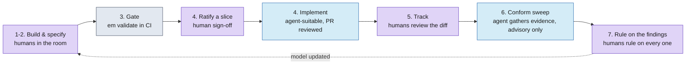

# The process: who does what

Event Modeling is a Software Development Life Cycle activity whose product is **shared
clarity** — stakeholders, product owners, and engineers agreeing, in one artifact, on how a
business process works and what must always be true about it. `em` mechanizes the artifact
(rendering, validation, diffing, drift detection); it never replaces the people. This document
is the map of which parts of the workflow require humans in the room, which parts an agent can
carry with human review, and where the boundary between them sits.

The other docs cover the mechanics: [workflow.md](workflow.md) is the lifecycle stage by
stage, [ai-workflow.md](ai-workflow.md) is the Claude Code skill. This one is organized by
**responsibility**.

## The one rule everything else follows from

> **Agents propose. Humans ratify.**

The model's entire authority rests on one property: everything in it was decided by a person,
on purpose. A stakeholder can trust the diagram, a product owner can trust a slice's
invariants, and an engineer can build against them *because* nothing entered the model by
autocomplete. Agents can draft, extract, render, diff, flag, and propose as hard as they like
— but the moment an agent writes an unratified decision into the model, the model stops being
a record of decisions and becomes just another generated artifact.

That's why the human checkpoints below are not process ceremony to optimize away. They are the
product.

## What "ratified" means

Used throughout these docs and the skill, **ratified** means: *a human decided this,
deliberately, and the decision is recorded in the model or its slice docs.* It shows up at
three specific points:

1. **Ratifying a slice** — the sign-off, after review, that flips a slice doc's `status` from
   `reviewed` to `ready-to-implement`: contracts and invariants are agreed, every open question is
   resolved or explicitly deferred. This is the second of the two per-slice human gates (the first
   is the review session itself — the whole sequence is
   [The slice lifecycle gates](#the-slice-lifecycle-gates) below), the handoff gate between
   deciding and building, and it's
   mechanically checkable: `em validate <model>.em --slice-ready <key>` verifies the doc,
   status, and open-question state in one command ([cli.md](cli.md#--slice-ready-key-mil-87)).
   `em slice ratify <model>.em <key> --by <name>` (MIL-165) makes the sign-off itself a
   mechanical, one-edit act, recording *who* ratified it and *when* in `ratifiedBy:`/
   `ratifiedOn:` frontmatter alongside the `status` flip
   ([cli.md](cli.md#em-slice-ratify-file-slice-key---by-name)) — pair it with a
   [CODEOWNERS](ci.md#codeowners-routing-ratification-review) rule on `slices/**` so the edit
   itself can't merge without review by a designated ratifier.
   **Re-ratifying** a slice that already shipped is the same act for a change: record the hop
   in the `## Delta` section, then `em slice reratify <model>.em <key>` (MIL-161,
   [cli.md](cli.md#em-slice-reratify-file-slice-key)) bumps `version:` and flips `status` back to
   `ready-to-implement` mechanically — mirroring `em slice mark-implemented`'s shape at the other
   end of the lifecycle ([slice-doc-schema.md](slice-doc-schema.md#status-under-re-ratification)).
2. **Ratifying model changes** — every edit to a committed `.em` or slice doc is a ratified
   decision, made in (or reviewed out of) a facilitated session. The PR review of a model
   change is part of this: the diff *is* the decision record.
3. **Ruling on conformance findings** — a *ruling*, not a ratification (the word is reserved
   for the design-exit gate in point 1), but the same human-decides shape: when the conform
   phase reports drift between model and code, a human rules on every finding (fix the model,
   open a red note, fix the prose — [workflow.md](workflow.md#7-rule-on-the-findings)). A ruling is a
   human gate, the same shape as ratifying a slice: an agent gathers evidence and proposes, a person decides, and the decision
   is recorded with a name and a date. The report proposes; you decide.
   **The findings themselves are structured data** (MIL-214): the conform skill writes
   `conformance/<date>-findings.json` alongside its `<date>-report.md`, one entry per `### n.`
   finding, ids matching (shape: [slice-doc-schema.md](slice-doc-schema.md);
   `em conform-findings check <path>` verifies a headless run wrote it correctly).
   `em conform-supersede <model> <report-path> --as-of <rev> --findings <spec> --locus <model|doc|code|none> --by <name>`
   (MIL-164/MIL-214,
   [cli.md](cli.md#em-conform-supersede-file-report-path)) is what records BOTH the ruling
   itself — `locus`/`resolvedBy`/`resolvedOn` on the named findings in that JSON — and the
   ruled-on report's "superseded as of `<rev>`" banner, so the record of what was decided
   stays legible without misleading a later reader into treating a historical report's
   file:line citations as current. `locus: code` on an unresolved finding is the first-class
   carrier for "spec is right, code is wrong" — no doc delta needed for that case any more.
   Once every in-scope finding touching a slice is ruled, `em slice conform <model> <key> --at
   <rev>` (MIL-214, [cli.md](cli.md#em-slice-conform-file-slice-key---at-rev)) records that
   THIS VERSION of that slice was certified — a fact `em state set-conformance` (below) checks
   before advancing the model-wide marker.
   `em state set-conformance` refuses while any `implemented` slice still has an unruled finding
   in scope (`--partial` escapes with a loud notice); nothing writes the marker for you.

## The slice lifecycle gates

A slice doc travels through four statuses, and **two of the three transitions between them are
human gates**. Each has its own command, its own recorded name and date, and — deliberately — its
own moment:

```
draft ──(review session)──▶ reviewed ──(ratification gate)──▶ ready-to-implement ──(merge)──▶ implemented
```

1. **`draft`** — the doc exists and is being written. `em slice new` scaffolds it here; the
   `slice` phase of the skill fills it in. No gate: drafting is work, not a decision.
2. **The review session → `reviewed`.** A facilitated walkthrough with the people who know the
   domain. A slice whose open questions are all resolved in the room ends the walkthrough with
   `em slice review <model>.em <key> --by <name>` ([cli.md](cli.md#em-slice-review-file-slice-key---by-name)),
   which flips `status` to `reviewed` and records `reviewedBy:`/`reviewedOn:`. Anything still
   open stays `draft`. **The facilitator never ratifies in a review session** — that is the next
   gate, and it is not theirs to run.
3. **The ratification gate → `ready-to-implement`.** Human, per-slice, and *typically
   multi-person*: the ratifier plus whoever will own the build. `em slice ratify <model>.em <key>
   --by <name>` ([cli.md](cli.md#em-slice-ratify-file-slice-key---by-name)) makes the sign-off one
   mechanical edit recording `ratifiedBy:`/`ratifiedOn:`, and it **refuses a doc that never passed
   through `reviewed`** unless `--skip-review` is passed (which prints a loud notice on stderr and
   writes nothing about the skip into the doc). The "multi-person" part is routed by the platform,
   not by `em`: put a [CODEOWNERS](ci.md#codeowners-routing-ratification-review) rule on
   `slices/**` naming your ratifiers, so the edit itself can't merge without their review.
   Confirm readiness mechanically with `em validate <model>.em --slice-ready <key>`.
4. **The merge → `implemented`.** Not a gate — bookkeeping. The implementing agent or engineer
   runs `em slice mark-implemented <model>.em <key> <pr-url>` at merge; the human checkpoint here
   was the PR review, which already happened.

A **continuation slice** (MIL-208 — a later `view X again` instance with no doc of its own)
skips all four statuses and both gates above: it inherits the originating slice's status
wholesale, since it isn't a spec unit to review, ratify, or mark implemented separately. See
[slice-doc-schema.md](slice-doc-schema.md#continuations).

**Re-ratification** re-enters the loop rather than repeating it: `em slice reratify <model>.em
<key>` ([cli.md](cli.md#em-slice-reratify-file-slice-key)) bumps `version:`, returns a shipped doc
to `ready-to-implement`, and clears both the old sign-off and the old review record (neither
describes the new version). A `em slice ratify --by <name>` following a `reratify` **does not need
a fresh review session** — the doc is already `ready-to-implement`, which the review gate accepts;
the delta was decided when it was written into the `## Delta` section.

Why two gates and not one: "the room understood this slice" and "we commit to building this
slice" are different decisions, made by different people, often days apart. Collapsing them means
whoever facilitated the review also authorized the build — which is exactly the failure the
one rule at the top of this document exists to prevent.

## The lifecycle, by responsibility

Same seven stages, same numbering, as [workflow.md](workflow.md) — this table adds the
responsibility columns:

| Stage | What happens | Who decides | What's mechanical |
|---|---|---|---|
| 1. Build the model | Facilitated sessions produce the timeline: events, commands, views, slices | **Humans in the room** — the AI facilitates and scribes, never invents a domain fact | Rendering, live view, validation |
| 2. Specify the slices | Each slice deepened: field contracts, invariants, Given/When/Then; then walked in a review session (`status: reviewed`) | **Humans answer**; the AI asks and drafts (`status: draft`) | Field-completeness warnings, `em slice review` |
| 3. Gate in CI | The committed model validated on every PR that touches it | — | `em validate` as a merge gate |
| 4. Hand off | **Humans ratify** the reviewed slice (status → `ready-to-implement`); then an **agent or engineer builds it, humans review the PR** | Ratification is human; the build is agent-suitable | `em slice ratify` (refuses an unreviewed doc), `em validate --slice-ready`, `em export`, the bridge |
| 5. Track change | Model diffs reviewed; changelog for the business | Humans review | `em diff`, `em changelog`, `em ledger` |
| 6. Check (conform) | Code checked against the model on a cadence; findings reported | Agent walks the code — **advisory only** | `em diff --json`, `driftSignal` |
| 7. Rule on the findings | Every finding gets a human ruling, logged with a date | **Humans** | `em validate --list-issues` keeps rulings visible |

Stages 1–2, the ratification gate inside 4, and stage 7 are where the humans are
load-bearing. The build half of stage 4 and the sweep half of stage 6 are where agents earn
their keep — bounded work, mechanical gates on both ends, human review of the result.



Purple is a human decision, blue is agent-suitable work reviewed by a human, gray is a
mechanical gate with no judgment call in it.

## Where humans are required, and why

- **Building the model (stages 1–2).** The knowledge being modeled lives in people's heads —
  the whole point of a session is extracting and *reconciling* it across stakeholders,
  product, and engineering. An AI facilitator asks good questions and keeps the diagram
  honest; it cannot know your business, and the skill is built never to pretend it does
  (anything unresolved is parked as a visible open question, not guessed).
- **Ratifying slices (the stage-4 gate).** A slice that reaches an implementer with
  unresolved questions gets those questions answered *by the implementer, silently* — the
  exact failure the gate exists to prevent. Ratification is cheap (a review and a status
  flip) precisely so it never gets skipped.
- **Ratifying the implementation constitution.** The project's house rules — stack, code style,
  testing norms, NFR baselines, review norms — are decisions about how *this team* builds, and an
  agent that assumes them has quietly made them. The implement skill asks the questions and drafts
  the answers; the document isn't in force until a named human ratifies it (empty `ratifiedBy:` =
  draft). See [Handing a slice to an agent](#handing-a-slice-to-an-agent).
- **Ruling on drift (stage 7).** Only a human can say whether the code or the model is right
  when they disagree — that's a business judgment, and the conform phase is deliberately
  advisory because a false accusation of drift destroys trust in the loop faster than real
  drift justifies it.

## Where agents do the work, with human review

- **Facilitation support** — asking, scribing, rendering, validating, keeping the state file.
  The humans decide; the agent types.
- **Drafting** — an agent may draft slice docs (`status: draft`), park incoming needs, and
  propose model edits for a session to take up. Proposals, not commits.
- **Implementation (stage 4)** — once a slice passes the readiness gate, implementation is
  agent-suitable end to end: the slice doc is a complete brief, the invariants and scenarios
  compile to tests, and the PR review is the human checkpoint. Before a project's first slice
  PR, a one-time foundation PR puts every model event (and the constitution's shared interface
  shell) in place, so no slice PR ever carries another slice's contracts. The bundled skill
  ships the full contract an implementing agent must follow —
  [the agent guide](../.claude/skills/event-modeling-implement/reference/implement.md) — including the
  readiness gate, the foundation step, the read-only rule on ratified docs, the propose-don't-decide
  rule for gaps, the lifecycle flip at merge, and the spec-kit adapter.
- **The conform sweep (stage 6)** — an agent gathers the evidence and writes the report;
  every verdict in it is a proposal for stage 7.

## Handing a slice to an agent

The short version of the [agent guide](../.claude/skills/event-modeling-implement/reference/implement.md),
for the human doing the handing:

0. **Once per project, before the first slice: the constitution exists and is ratified.** The
   implementation constitution is the project's house rules for *how* implementation happens —
   stack and architectural shape (including which implementation skill each slice pattern routes
   to), code style, testing norms, NFR baselines, review and merge norms. It lives in exactly one
   place: `.specify/memory/constitution.md` in a spec-kit project, otherwise `constitution.md`
   beside the model (`em scaffold` writes the template there). The implement skill elicits it in a
   short conversation and drafts the answers; **a named human signs it off** — `ratifiedBy:`/
   `ratifiedOn:` in the em-native file, spec-kit's own `**Ratified**:` footer in
   `.specify/memory/constitution.md`. An empty `ratifiedBy:` means draft, and an implementing
   agent is told to stop rather than decide the project's stack or style for you.
   `em status` reports it per model (`constitution: present` / `absent (<path>)`) — existence
   only; `em` never reads or judges its content. See
   [cli.md](cli.md#em-status-files) and the agent guide's §7.
1. Ratify the slice — `em slice ratify <model>.em <key> --by <name>` (status →
   `ready-to-implement`, records who/when), open questions resolved — and confirm:
   `em validate <model>.em --slice-ready <key>` exits 0. Ratification comes *after* the review
   gate (`em slice review`, status → `reviewed`); `ratify` refuses a doc that skipped it unless
   you pass `--skip-review`. See [The slice lifecycle gates](#the-slice-lifecycle-gates).
2. Point the agent at the slice doc and the guide. If the skill is installed in the repo
   (`em skill install`), the guide is already there.
3. Review the PR like any other — plus two model-side checks: the slice doc's only edits are
   the merge-time `status`/`implementedIn` flip, and no new spec-shaped artifacts got
   committed as sources of truth.

If the project uses spec-kit, the agent allocates through
[em-sdd-bridge](https://github.com/milehimikey/em-sdd-bridge) instead of running
`/speckit.specify` — the ratified slice doc itself is the spec, symlinked into the spec dir
(redirect mode). [em-sdd-preset](https://github.com/milehimikey/em-sdd-preset) packages the
templates and prompt overlays that make spec-kit's plan/tasks phases read a slice doc
natively. Both are separate, versioned packages; their READMEs are the reference — `em`'s own
docs deliberately don't duplicate them.

## What the tool enforces vs. what it leaves to you

`em` is strict about what is unambiguously wrong (structural errors fail `em validate`;
readiness is a hard gate when you invoke it) and advisory about everything that requires
judgment (warnings, conformance findings, ledger checks are all opt-in or non-blocking — the
full table is in [workflow.md](workflow.md#which-parts-enforce-and-which-advise)). The
pattern is the same rule again: mechanical checks gate mechanical properties; humans ratify
judgments. A model is a description of a business, and no tool gets to overrule you about
your own business.
