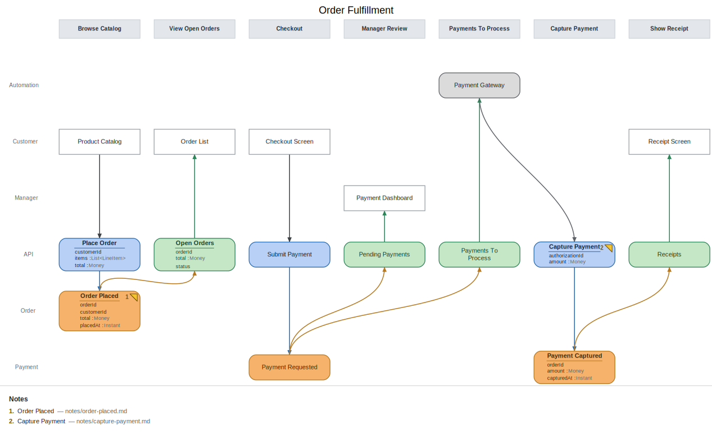

# Tutorial: your first event model

This walkthrough builds a small order-fulfillment model from an empty file, one slice at a
time. Along the way it touches everything the tool does: rendering, live watch, validation,
fields, and linked notes. Budget about twenty minutes.

## What you'll build



Seven slices telling one story: a customer places an order, checks out, a payment gateway
captures the payment automatically, and a receipt appears. It exercises three of the
[four patterns](patterns.md) — State Change, State View, and Automation. (The fourth,
Translation, works the same way as Automation; patterns.md covers it.)

The finished source lives at [examples/order-fulfillment.em](../examples/order-fulfillment.em).

## 1. Setup

```bash
npm install -g @milehimikey/em
mkdir order-fulfillment && cd order-fulfillment
```

Create `order-fulfillment.em` with just a title and two swimlane declarations:

```em
model "Order Fulfillment"

persona Customer

context Order
```

A `persona` is an actor: each one gets a UI row near the top of the diagram. A `context` is
a bounded context or aggregate: each one gets an event row at the bottom. Between them sits
the API lane, where commands and read models will go. Render it:

```bash
em render order-fulfillment.em    # -> order-fulfillment.svg
```

Open the SVG in a web browser. It's an empty grid of swimlanes — a stage with no story yet.

(If you'd rather explore a finished model than type one, `em init` scaffolds the structure
this tutorial builds. Building it by hand is the point here.)

## 2. Keep a live view open

```bash
em watch order-fulfillment.em --serve
```

This re-renders on every save and prints a URL like
`http://localhost:5173/?svg=order-fulfillment.svg`. Open it in a browser and leave it open:
for the rest of the tutorial, every save appears there instantly. This is also the mode to
use when modeling with a team on a shared screen.

Work in a second terminal (or your editor) from here on.

## 3. First slice: a state change

A slice is one vertical step of the story — one column, with time running left to right.
The first pattern, **State Change**, is how anything ever happens: a user on a screen
issues a command, and the system records the outcome as an event.

Make the file read:

```em
model "Order Fulfillment"

persona Customer

context Order

slice "Browse Catalog" {
  ui Product Catalog @Customer
  command Place Order
  event Order Placed @Order
}
```

Save, and watch the browser. Three boxes appear in one column: the screen in the Customer
row (`@Customer` picked the row), the command in the API lane, the event in the Order row.
The arrows between them were inferred — within a slice, the pattern determines the flow, so
you never draw them yourself.

Two naming conventions do a lot of work in event models: commands are imperative ("Place
Order" — a request that can be refused) and events are past tense ("Order Placed" — a fact
that already happened).

## 4. Second slice: a state view

The second pattern, **State View**, gets information back out: past events are projected
into a read model that a screen displays. Append:

```em
slice "View Open Orders" {
  view Open Orders from "Order Placed"
  ui Order List @Customer
}
```

The `from "Order Placed"` clause wires the data flow — an arrow now runs from the event in
slice one to the read model in slice two, then up to the screen. Reading the diagram left
to right already tells a story: an order is placed, so it shows up in the customer's list.

Commands and read models share the API lane. That's deliberate: a slice either changes
state or reads it, never both.

## 5. Break it on purpose

Before the model gets bigger, meet the validator. Misspell the event name in the slice you
just wrote:

```em
  view Open Orders from "Order Plased"
```

On save, the watcher prints:

```
  error:14 read model "Open Orders" references unknown event "Order Plased"
skipped render (errors above)
```

The render was skipped, the browser keeps the last good diagram, and the same check runs
standalone as `em validate order-fulfillment.em` (non-zero exit on errors, so it slots into
CI). The validator knows the rules of Event Modeling — every `from` must name a real event,
commands should record events, time may only flow left to right — and it's what keeps a
model honest once an AI or a whole team is editing it. The full rule list is in
[validation.md](validation.md).

Fix the spelling before moving on.

## 6. Let the system act: automation

So far a human does everything. The **Automation** pattern is how the system acts on its
own. First, give it something to act on — a checkout step that requests payment. This
introduces a second context, so add `context Payment` under `context Order`, then append:

```em
slice "Checkout" {
  ui Checkout Screen @Customer
  command Submit Payment
  event Payment Requested @Payment
}
```

The Payment row appears at the bottom with the new event in it. A manager wants to see
pending payments too — a plain state view, but for a different persona. Add
`persona Manager` under `persona Customer`, then:

```em
slice "Manager Review" {
  view Pending Payments from "Payment Requested"
  ui Payment Dashboard @Manager
}
```

Now the automation itself. Think of it as a payment gateway watching a to-do list: the read
model collects payments that need processing, and a processor works through them. The
pattern takes **two slices**:

```em
slice "Payments To Process" {
  view Payments To Process from "Payment Requested"
  processor Payment Gateway
}

slice "Capture Payment" {
  command Capture Payment
  event Payment Captured @Payment
}
```

The first slice holds only the to-do list and the processor — a new band appears across the
top of the diagram for it. The command it triggers, and that command's event, form the
*next* slice. This split is the heart of the pattern: a processor never records an event
itself. It issues a command like everyone else, so "Capture Payment" keeps its invariants
whether a human or a machine is calling. (Putting the command in the processor's slice is a
validation warning.)

Close the loop with a receipt:

```em
slice "Show Receipt" {
  view Receipts from "Payment Captured"
  ui Receipt Screen @Customer
}
```

Seven slices. The whole story now reads left to right across the diagram, and
`em validate` has nothing to say about it.

## 7. Add fields

Boxes with just names show flow, but not what data moves. Any element can carry a field
block. Give the first slice's command and event their data:

```em
slice "Browse Catalog" {
  ui Product Catalog @Customer
  command Place Order {
    customerId
    items: List<LineItem>
    total: Money
  }
  event Order Placed @Order {
    orderId
    customerId
    total: Money
    placedAt: Instant
  }
}
```

The boxes grow into little UML-style tables: name, divider, fields. Types are free text —
annotate as much or as little as helps. Columns stay aligned as boxes grow, so the grid
never drifts.

Do the same for the read model in "View Open Orders" (`orderId`, `total: Money`, `status`)
and for the capture slice — the final listing below has all of them. Fields are what make a
model implementable: they're the raw material for checking that every field a screen shows
can be traced back to an event that recorded it.

## 8. Attach notes

The diagram should stay structural; depth belongs in prose. Any element can link a markdown
file. Point the Order Placed event at one:

```em
  event Order Placed @Order note "notes/order-placed.md" {
```

Save, and the watcher warns:

```
  warn  note file not found for "Order Placed": notes/order-placed.md
```

It still renders — the warning is a nudge. Create the file:

```bash
mkdir notes
```

```markdown
# Order Placed

The order is priced and reserved. `total` is the price at placement time;
later price changes never touch a placed order.
```

The event's box now has a small numbered folded-corner marker, and a legend below the
diagram maps the number to the note file. In the browser, the marker and the legend row are
links straight to the markdown. Add a second note, `notes/capture-payment.md`, to the
Capture Payment command the same way.

This is the mechanism deep slice designs hang off of: one markdown spec per slice, linked
from the diagram, with the `.em` staying readable.

## 9. The finished model

```em
model "Order Fulfillment"

persona Customer
persona Manager

context Order
context Payment

slice "Browse Catalog" {
  ui Product Catalog @Customer
  command Place Order {
    customerId
    items: List<LineItem>
    total: Money
  }
  event Order Placed @Order note "notes/order-placed.md" {
    orderId
    customerId
    total: Money
    placedAt: Instant
  }
}

slice "View Open Orders" {
  view Open Orders from "Order Placed" {
    orderId
    total: Money
    status
  }
  ui Order List @Customer
}

slice "Checkout" {
  ui Checkout Screen @Customer
  command Submit Payment
  event Payment Requested @Payment
}

slice "Manager Review" {
  view Pending Payments from "Payment Requested"
  ui Payment Dashboard @Manager
}

slice "Payments To Process" {
  view Payments To Process from "Payment Requested"
  processor Payment Gateway
}

slice "Capture Payment" {
  command Capture Payment note "notes/capture-payment.md" {
    authorizationId
    amount: Money
  }
  event Payment Captured @Payment {
    orderId
    amount: Money
    capturedAt: Instant
  }
}

slice "Show Receipt" {
  view Receipts from "Payment Captured"
  ui Receipt Screen @Customer
}
```

```bash
em validate order-fulfillment.em
ok — no issues
```

## Where to go next

- [patterns.md](patterns.md) — the Translation pattern this tutorial skipped, and modeling
  headless/API systems with no UI at all.
- [timeline.md](timeline.md) — the Two Laws of the Timeline, and `view … again` for read
  models that keep evolving.
- [dsl.md](dsl.md) — the full DSL reference, including explicit `arrow`s.
- [ai-workflow.md](ai-workflow.md) — let Claude drive this whole process through a guided,
  resumable modeling session.
- [examples/insurance-claim.em](../examples/insurance-claim.em) — a richer model: three
  personas, processor automations, a translation, and a multi-source read model.
